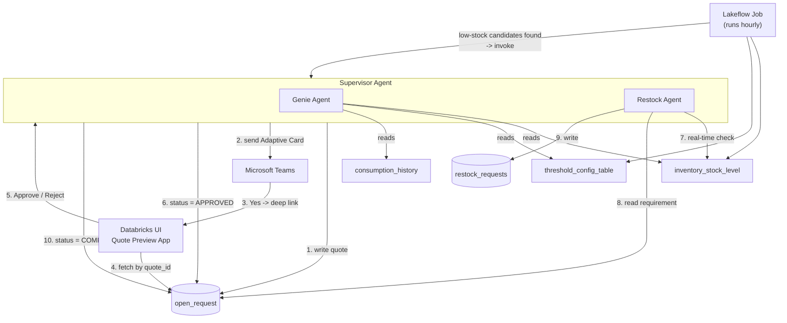
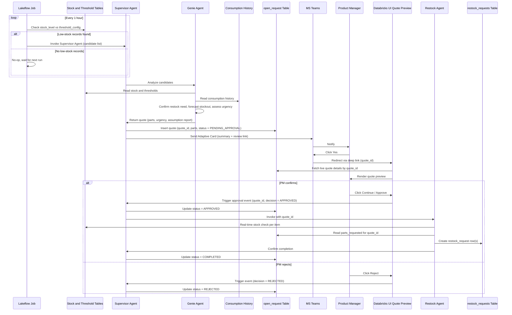
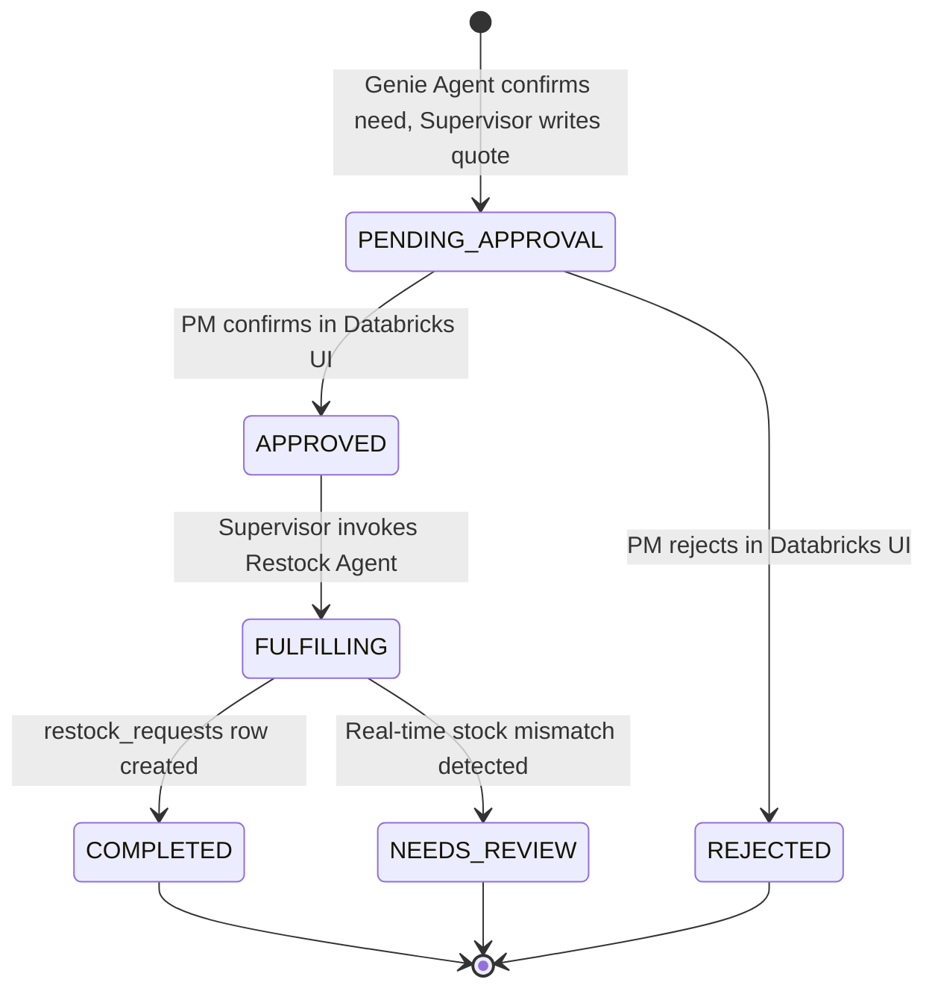

# Agentic Restock Workflow — Architecture Design
### Databricks Multi-Agent Pipeline with Human-in-the-Loop Approval

---

## 1. Purpose & Scope

This document describes the architecture for an agentic restocking pipeline built on Databricks. A scheduled **Lakeflow Job** acts as the entry trigger, watching for low stock; when it fires, it hands off to a **Supervisor Agent** that owns the full workflow — deep analysis via a **Genie Agent**, a two-step human approval (Microsoft Teams notification → Databricks UI confirmation), and, once approved, real-time validation and fulfillment via a **Restock Agent**.

**In scope:** trigger design, agent responsibilities, data flow, table schema, the HITL redirect pattern, and request lifecycle.
**Out of scope:** procurement/ERP integration after `restock_requests` is written, multi-approver delegation chains, and notification-channel failover (flagged as open questions in §11).

---

## 2. Actors & Components

| Component | Role |
|---|---|
| **Lakeflow Job** | Scheduled Databricks job (runs **hourly**). Performs a lightweight threshold match against `inventory_stock_level` and `threshold_config_table`. Purely a trigger/filter — invokes the Supervisor Agent only when low-stock candidates exist. |
| **Supervisor Agent** | Orchestrator invoked by the Lakeflow Job. Owns the end-to-end flow: hands candidates to the Genie Agent for analysis, writes/updates `open_request`, sends the Teams notification, waits for the Databricks UI decision, and invokes the Restock Agent on approval. |
| **Genie Agent** | Sub-agent of the Supervisor Agent. Given the candidate list, performs the deeper analysis — consumption trend, stockout forecast, urgency — and finalizes *whether restocking is actually needed*, producing the quote/assumption report. |
| **Restock Agent** | Sub-agent of the Supervisor Agent. Invoked only after approval; re-validates stock in real time against the quote and writes the final restock request. |
| **Microsoft Teams** | First-touch notification channel. Delivers the quote summary and a review link — it is *not* where the final decision is made. |
| **Databricks UI (Review App)** | Second-touch confirmation surface. Shows a live, full-fidelity preview of the quote pulled directly from the table, and is where "Approve" / "Reject" actually happens. |

---

## 3. High-Level Architecture



---

## 4. End-to-End Workflow

0. **Lakeflow Job** runs every hour, querying `inventory_stock_level` joined with `threshold_config_table` for any item/warehouse where stock has fallen at or below the reorder point.
   - **No matches** → job exits. No agent invocation, negligible cost.
   - **One or more matches** → job invokes the **Supervisor Agent**, passing the candidate item/warehouse list.
1. Supervisor Agent hands the candidates to the **Genie Agent** for deep analysis.
2. Genie Agent reads `inventory_stock_level`, `threshold_config_table`, and `consumption_history` for those candidates, computes average daily consumption, forecasts stockout dates, assigns urgency, and **finalizes whether restocking is genuinely needed** — it can filter out false positives the coarse check flagged. It returns a quote (parts, quantities, urgency, assumption report) to the Supervisor Agent.
3. Supervisor Agent inserts a row into `open_request` (`quote_id`, parts, `request_status = PENDING_APPROVAL`).
4. Supervisor Agent sends a Teams Adaptive Card to the Product Manager with the quote summary and a **review link** (not an approve button).
5. PM clicks **"Yes"** in Teams → this is only an *intent-to-review* signal. Teams redirects to the **Databricks UI**, deep-linked with `quote_id`.
6. The Databricks UI queries `open_request` live by `quote_id` and renders the full quote preview.
7. The PM reviews and clicks **Continue/Approve** or **Reject** — the actual decision point.
8. On **Approve**: the Databricks UI notifies the Supervisor Agent, which sets `open_request.request_status = APPROVED` and invokes the **Restock Agent**.
9. The **Restock Agent** re-checks `inventory_stock_level` in real time (stock may have shifted since the quote was generated), reconciles against the quoted `parts_requested`, and writes the confirmed line item(s) to `restock_requests`.
10. Supervisor Agent updates `open_request.request_status = COMPLETED`. Flow ends.
11. On **Reject** (from the Databricks UI): `open_request.request_status = REJECTED`; the Restock Agent is never invoked. Flow ends.

### 4.1 Lakeflow Job — Coarse Low-Stock Check (Trigger)

```
SELECT isl.item_id, isl.warehouse_id, isl.current_stock_qty, tct.reorder_point_qty
FROM inventory_stock_level isl
JOIN threshold_config_table tct
  ON isl.item_id = tct.item_id AND isl.warehouse_id = tct.warehouse_id
WHERE tct.is_active = true
  AND isl.current_stock_qty <= tct.reorder_point_qty
```

If the result set is non-empty, the job invokes the Supervisor Agent, passing the matched rows as the candidate payload. This keeps the hourly cost low — it's a single indexed join, not a full analysis — and the expensive work (consumption trend, forecasting) only runs when there's a real signal.

### 4.2 Genie Agent — Deep Analysis & Quote Generation

```
avg_daily_consumption = AVG(qty_consumed) FROM consumption_history
    WHERE item_id = X AND consumption_date >= today - 14 days

days_remaining = current_stock_qty / avg_daily_consumption
predicted_stockout_date = today + days_remaining
requested_qty = target_stock_qty - current_stock_qty

urgency:
  CRITICAL  -> stockout <= 3 days OR current_stock_qty <= minimum_stock_qty
  HIGH      -> stockout <= 7 days
  MEDIUM    -> stockout <= 14 days
  LOW       -> otherwise
```

This runs only against the candidates the Lakeflow Job already flagged — the Genie Agent doesn't re-scan the whole table. It has authority to decide *no restock needed* for a candidate (e.g., a shipment is already inbound), in which case no quote or Teams message is generated for that item.

---

## 5. Human-in-the-Loop Design (Key Change)

> **The Teams click is a soft trigger, not an approval.** Adaptive Cards have limited fidelity (no live data grid, easy to mis-tap, weak audit trail). Final approval is deliberately deferred to a Databricks-hosted review surface that always reflects current data.



**Deep link pattern:** the Teams card's link is built as
`https://<workspace>.databricks.com/apps/restock-review?quote_id=<quote_id>`
so the review app can pre-filter to exactly that quote and re-query fresh state rather than trusting anything cached in the card.

---

## 6. Data Model

### 6.1 New table — `open_request`

| Column | Type | Description |
|---|---|---|
| `quote_id` | STRING | Unique quote identifier (PK), e.g. `QT-20260813-0001` |
| `request_status` | STRING | `PENDING_APPROVAL`, `APPROVED`, `REJECTED`, `FULFILLING`, `NEEDS_REVIEW`, `COMPLETED` |
| `parts_requested` | ARRAY\<STRUCT\> | `item_id`, `item_name`, `warehouse_id`, `current_stock_qty`, `reorder_point_qty`, `requested_qty`, `unit_of_measure` |
| `urgency_level` | STRING | `CRITICAL`, `HIGH`, `MEDIUM`, `LOW` |
| `predicted_stockout_date` | DATE | Earliest predicted stockout across items in the quote |
| `summary_report` | STRING | Genie Agent's natural-language assumption/reasoning report |
| `teams_message_id` | STRING | Reference to the Adaptive Card sent |
| `teams_sent_at` | TIMESTAMP | When the Teams notification went out |
| `databricks_preview_url` | STRING | Deep link used for the review app |
| `reviewed_by` | STRING | PM/approver who acted |
| `decision` | STRING | `APPROVED` / `REJECTED` |
| `decision_at` | TIMESTAMP | When the decision was made in the Databricks UI |
| `decision_comments` | STRING | Optional approver comments |
| `created_by` | STRING | `supervisor_agent` (on behalf of Genie Agent's analysis) |
| `created_at` | TIMESTAMP | |
| `updated_at` | TIMESTAMP | |

**Primary key:** `quote_id`

### 6.2 Modification to existing table — `restock_requests`

| Column | Type | Description |
|---|---|---|
| `quote_id` | STRING | FK → `open_request.quote_id` |

### 6.3 Relationship to the original schema

- `inventory_stock_level`, `threshold_config_table`, `consumption_history` are unchanged. The Lakeflow Job reads the first two for the coarse check; the Genie Agent reads all three for deep analysis; the Restock Agent re-reads `inventory_stock_level` for real-time validation.
- `open_request` takes over the role your original `restock_requests` + `approval_requests` pairing played — one working record per quote.
- `restock_requests` becomes the **fulfillment ledger**, written only after real-time validation succeeds, referencing `quote_id`.
- Whether `approval_requests` is deprecated or repurposed as a fine-grained audit log is an open question in §11.

---

## 7. Request Lifecycle



Note: a Lakeflow-flagged candidate that the Genie Agent decides does *not* need restocking never enters this lifecycle — no `open_request` row is created for it.

---

## 8. Integration Points

| Integration | Notes |
|---|---|
| **Lakeflow Job scheduling** | Native Databricks scheduled job, hourly cadence, running the threshold-match query in §4.1. Invokes the Supervisor Agent conditionally (e.g., via Jobs API / Agent Framework call) only on a non-empty result. |
| **Teams delivery** | Adaptive Card via Incoming Webhook or Bot Framework. The card's action is a link/deep-link, not an in-card "Approve" button. |
| **Databricks Review App** | A Databricks App (or Lakehouse App) that queries `open_request` by `quote_id` via a SQL Warehouse and renders the preview. Approve/Reject calls back into the Supervisor Agent. |
| **Supervisor Agent** | Orchestration layer (e.g., Mosaic AI Agent Framework / LangGraph-style graph) that treats Genie Agent and Restock Agent as tool calls / sub-agents, and owns all `open_request` writes. |
| **Restock Agent** | Re-reads `inventory_stock_level` fresh at invocation time rather than trusting the quote's snapshot. |

---

## 9. Edge Cases & Failure Handling (recommended)

- **Genie Agent overrides a Lakeflow-flagged candidate**: no quote created, no Teams message sent — recommend logging the reasoning for observability even when no action is taken.
- **Overlapping runs**: if a later hourly scan flags an item that already has a `PENDING_APPROVAL` quote open, suppress creating a duplicate quote for that item until the existing one resolves.
- **PM abandons before confirming**: quote sits in `PENDING_APPROVAL`. Recommend a TTL/reminder job that re-notifies or expires stale quotes.
- **Stock changed materially between quote creation and approval**: Restock Agent should move the quote to `NEEDS_REVIEW` instead of blindly creating a restock request.
- **Duplicate/idempotent invocation**: Restock Agent's write to `restock_requests` should be idempotent on `quote_id` to avoid double-creation on retries.

---

## 10. Non-Functional Considerations

- **Cost shape**: the hourly Lakeflow Job is a cheap indexed join; the expensive consumption-trend analysis only runs when the Genie Agent is actually invoked, keeping compute proportional to real signal rather than running deep analysis every hour regardless.
- **Auth**: Teams webhook should be scoped/signed; the Databricks Review App should sit behind SSO so `reviewed_by` is trustworthy for audit purposes.
- **Auditability**: `open_request` captures who decided what and when; consider the audit-log addition in §11 if per-touchpoint (not just per-decision) history is required.
- **Latency**: steps 5–7 (Teams click → Databricks preview render) should be low-latency since it's a synchronous human wait.

---

## 11. Assumptions & Open Questions

1. **Candidate hand-off**: assumed the Lakeflow Job passes its matched rows directly to the Supervisor Agent as an invocation payload, rather than the Supervisor/Genie Agent re-querying from scratch. Confirm this is the intended interface.
2. **Genie Agent veto power**: assumed Genie Agent can decide *no restock needed* even for a Lakeflow-flagged candidate, and that this produces no quote/notification. Confirm this is desired vs. always surfacing every candidate to a human.
3. **Single approver**: the flow assumes one PM approves per quote. Multi-approver/delegation is out of scope.
4. **Duplicate-quote suppression**: recommended in §9 but not explicitly requested — confirm desired behavior when the same item is flagged while a quote is already open.
5. **Threshold column**: assumed `reorder_point_qty` (not `minimum_stock_qty`) is the trigger threshold for the Lakeflow Job's coarse check, with `minimum_stock_qty` used downstream for urgency scoring.

---
