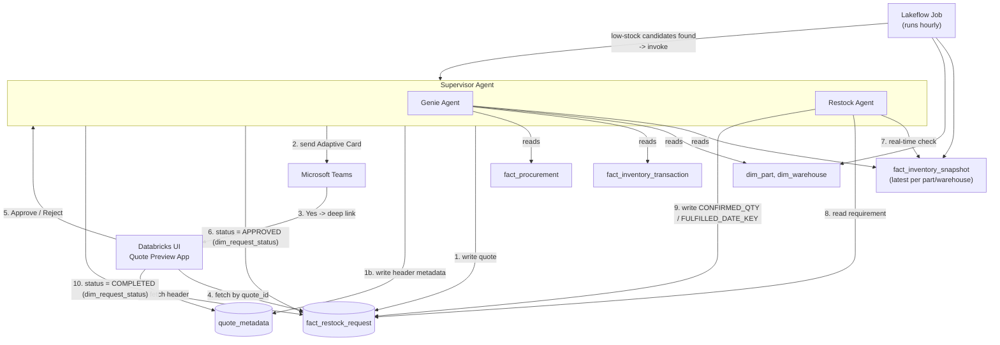
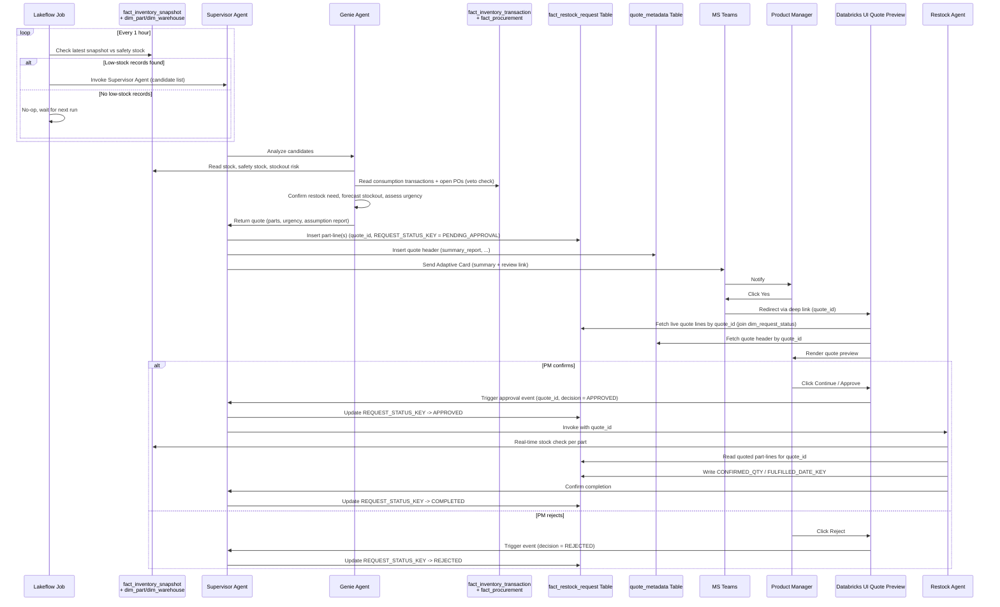
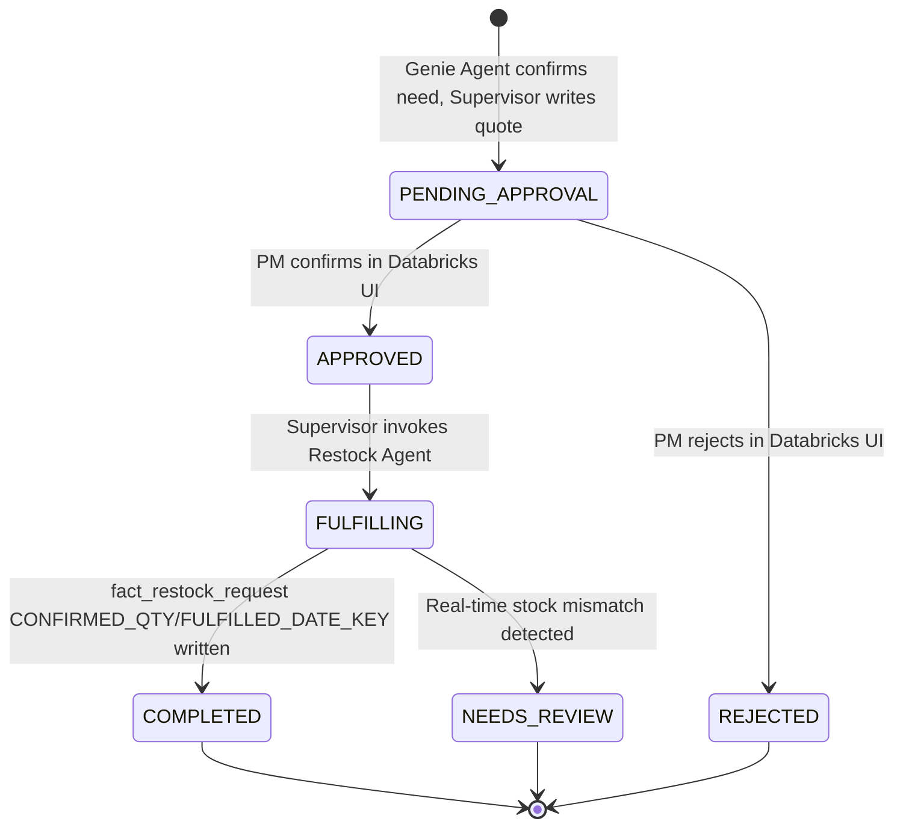

# Inventory Intelligence Workflow — Architecture Design
### Databricks Multi-Agent Pipeline with Human-in-the-Loop Approval

> ## ⚠️ Superseded — historical record
>
> This document describes the **original single-layer design**: a §4.1 coarse
> low-stock check emitting a candidate list, and a §4.2 deep-analysis pass over
> it. That shape no longer exists. The coarse check was replaced by the
> `inventory_signal_board` (a full table, one row per part/warehouse, every
> nuance as a set-wise column) and the candidate list by a single
> decision-value-ranked action per run.
>
> It is kept because the code and the other docs still cite its section
> numbers (§4.1, §4.2, §5, §6, §7) and because the HITL redirect pattern in §5
> and the data model in §6 are still substantially accurate.
>
> **For current behaviour read, in order:**
> [`end_to_end_walkthrough.md`](end_to_end_walkthrough.md) (the pipeline in
> plain language) · [`market_evidence_phase1.md`](market_evidence_phase1.md)
> (phase-1 requirements and open questions) ·
> [`agent_bricks_mapping.md`](agent_bricks_mapping.md) (what is actually
> deployed and why).
>
> Known specifics superseded here: §4.1's coarse check · §4.2's "deep analysis
> over a candidate list" · the `Restock Agent` as a separate component (it is
> the `restock_decision` job) · `ab_training.agentic_restock` as a location
> (everything is in `gold_dev` now).

---

## 1. Purpose & Scope

This document describes the architecture for an agentic restocking pipeline built on Databricks. A scheduled **Lakeflow Job** acts as the entry trigger, watching for low stock; when it fires, it hands off to a **Supervisor Agent** that owns the full workflow — deep analysis via a **Genie Agent**, a two-step human approval (Microsoft Teams notification → Databricks UI confirmation), and, once approved, real-time validation and fulfillment via a **Restock Agent**.

**In scope:** trigger design, agent responsibilities, data flow, table schema, the HITL redirect pattern, and request lifecycle.
**Out of scope:** procurement/ERP integration beyond what's already reflected in `fact_procurement`, multi-approver delegation chains, and notification-channel failover (flagged as open questions in §11).

**Data ownership note:** the real inventory/consumption/procurement/restock-request
data is Data Engineering's `gold_dev` star schema (`gold_dev.dim` +
`gold_dev.supply_chain_analytics`), not a schema this pipeline owns. This repo
owns only the §4.2 Unity Catalog functions and `quote_metadata` (a companion
table for Teams/Review-App fields that don't fit the DE-owned fact table's
grain). Both now live in `gold_dev.supply_chain_analytics`; the
`ab_training.agentic_restock` schema this doc originally named is retired. See
§6 for the full table mapping.

---

## 2. Actors & Components

| Component | Role |
|---|---|
| **Lakeflow Job** | Scheduled Databricks job (runs **hourly**). Performs a lightweight threshold match against the latest `fact_inventory_snapshot` row per part/warehouse. Purely a trigger/filter — invokes the Supervisor Agent only when low-stock candidates exist. |
| **Supervisor Agent** | Orchestrator invoked by the Lakeflow Job. Owns the end-to-end flow: hands candidates to the Genie Agent for analysis, writes/updates `fact_restock_request` + `quote_metadata`, sends the Teams notification, waits for the Databricks UI decision, and invokes the Restock Agent on approval. |
| **Genie Agent** | Sub-agent of the Supervisor Agent. Given the candidate list, performs the deeper analysis — consumption trend, stockout forecast, urgency — and finalizes *whether restocking is actually needed*, producing the quote/assumption report. |
| **Restock Agent** | Sub-agent of the Supervisor Agent. Invoked only after approval; re-validates stock in real time against the quote and writes the final restock request. |
| **Microsoft Teams** | First-touch notification channel. Delivers the quote summary and a review link — it is *not* where the final decision is made. |
| **Databricks UI (Review App)** | Second-touch confirmation surface. Shows a live, full-fidelity preview of the quote pulled directly from the table, and is where "Approve" / "Reject" actually happens. |

---

## 3. High-Level Architecture



---

## 4. End-to-End Workflow

0. **Lakeflow Job** runs every hour, taking the latest `fact_inventory_snapshot` row per part/warehouse (joined to `dim_part`/`dim_warehouse`) for any part/warehouse where stock has fallen at or below the safety-stock reorder point.
   - **No matches** → job exits. No agent invocation, negligible cost.
   - **One or more matches** → job invokes the **Supervisor Agent**, passing the candidate part/warehouse list.
1. Supervisor Agent hands the candidates to the **Genie Agent** for deep analysis.
2. Genie Agent reads `fact_inventory_snapshot`, `fact_inventory_transaction`, and `fact_procurement` for those candidates, computes average daily consumption, forecasts stockout dates, assigns urgency, and **finalizes whether restocking is genuinely needed** — it can filter out false positives the coarse check flagged (now backed by a real veto check against open purchase orders, not a stub). It returns a quote (parts, quantities, urgency, assumption report) to the Supervisor Agent.
3. Supervisor Agent inserts part-line row(s) into `fact_restock_request` (`quote_id`, part/warehouse, `REQUEST_STATUS_KEY` → `PENDING_APPROVAL`) and a matching header row into `quote_metadata` (`summary_report`, ...).
4. Supervisor Agent sends a Teams Adaptive Card to the Product Manager with the quote summary and a **review link** (not an approve button).
5. PM clicks **"Yes"** in Teams → this is only an *intent-to-review* signal. Teams redirects to the **Databricks UI**, deep-linked with `quote_id`.
6. The Databricks UI queries `fact_restock_request` (joined to `dim_request_status`) and `quote_metadata` live by `quote_id` and renders the full quote preview.
7. The PM reviews and clicks **Continue/Approve** or **Reject** — the actual decision point.
8. On **Approve**: the Databricks UI notifies the Supervisor Agent, which points the quote's `REQUEST_STATUS_KEY` at the `APPROVED` row in `dim_request_status` and invokes the **Restock Agent**.
9. The **Restock Agent** re-checks `fact_inventory_snapshot` in real time (stock may have shifted since the quote was generated), reconciles against the quoted part-lines, and writes `CONFIRMED_QTY`/`FULFILLED_DATE_KEY` back onto the `fact_restock_request` row(s).
10. Supervisor Agent updates the quote's `REQUEST_STATUS_KEY` to `COMPLETED`. Flow ends.
11. On **Reject** (from the Databricks UI): `REQUEST_STATUS_KEY` → `REJECTED`; the Restock Agent is never invoked. Flow ends.

### 4.1 Lakeflow Job — Coarse Low-Stock Check (Trigger)

```
WITH latest_snapshot AS (
  SELECT *, ROW_NUMBER() OVER (PARTITION BY PART_KEY, WAREHOUSE_KEY ORDER BY SNAPSHOT_DATE_KEY DESC) AS rn
  FROM fact_inventory_snapshot
)
SELECT dp.PART_ID, dw.WAREHOUSE_ID, ls.QUANTITY_ON_HAND, ls.SAFETY_STOCK_QTY
FROM latest_snapshot ls
JOIN dim_part dp ON ls.PART_KEY = dp.PART_KEY AND dp.IS_CURRENT = true
JOIN dim_warehouse dw ON ls.WAREHOUSE_KEY = dw.WAREHOUSE_KEY
WHERE ls.rn = 1
  AND dp.LIFECYCLE_STATUS = 'ACTIVE'
  AND dw.OPERATIONAL_STATUS = 'ACTIVE'
  AND ls.QUANTITY_ON_HAND <= ls.SAFETY_STOCK_QTY
```

If the result set is non-empty, the job invokes the Supervisor Agent, passing the matched rows as the candidate payload. This keeps the hourly cost low — it's a single indexed join (plus taking the latest snapshot row), not a full analysis — and the expensive work (consumption trend, forecasting) only runs when there's a real signal. See `src/agentic_restock/jobs/lakeflow_trigger.py::build_coarse_check_query()` for the exact generated SQL.

### 4.2 Genie Agent — Deep Analysis & Quote Generation

See [`docs/uc_functions_reference.md`](uc_functions_reference.md) for the
full per-function reference (signature, use case, edge cases, examples) of
every Unity Catalog function backing this section.

```
avg_daily_consumption = SUM(QUANTITY) / 14 FROM fact_inventory_transaction
    WHERE PART_ID = X AND TRANSACTION_TYPE = 'ISSUE' AND TRANSACTION_DATE_KEY >= today - 14 days

days_remaining = current_stock_qty / avg_daily_consumption
predicted_stockout_date = today + days_remaining
requested_qty = MAX_STOCK_LEVEL - current_stock_qty

urgency:
  CRITICAL  -> stockout <= 3 days OR fact_inventory_snapshot.STOCKOUT_RISK = 'HIGH'
  HIGH      -> stockout <= 7 days
  MEDIUM    -> stockout <= 14 days
  LOW       -> otherwise

restock veto (no longer a single boolean function — Genie reasons it out from
two atomic UC functions, so it can explain the "why", not just yes/no):
  pending_qty = pending_procurement_qty(part_id, warehouse_id)
    -- SUM(PENDING_QTY) across open (ISSUED/PARTIAL) POs in fact_procurement
       at the warehouse's linked plant; 0.0 if none, or if there's no linked
       plant at all
  FALSE (false positive) -> pending_qty >= requested_qty
  TRUE  (genuinely needs restocking) -> otherwise, reporting the remaining
                                         gap (requested_qty - pending_qty)
  -- open_procurement_orders(part_id, warehouse_id) returns the row-level POs
     (PO id, supplier, expected date) backing pending_qty, for when Genie
     needs to name the specific order in its explanation
```

This runs only against the candidates the Lakeflow Job already flagged — the Genie Agent doesn't re-scan the whole table. It has authority to decide *no restock needed* for a candidate (backed by comparing `requested_restock_qty` against `pending_procurement_qty`'s view of `fact_procurement`'s open purchase orders, not a stub), in which case no quote or Teams message is generated for that item. There is no `lead_time_days` config field anywhere in `gold_dev` — `avg_lead_time_days` derives an empirical estimate from `fact_procurement` history instead, surfaced as informational text only (not used by `classify_urgency` or the veto).

---

## 5. Human-in-the-Loop Design (Key Change)

> **The Teams click is a soft trigger, not an approval.** Adaptive Cards have limited fidelity (no live data grid, easy to mis-tap, weak audit trail). Final approval is deliberately deferred to a Databricks-hosted review surface that always reflects current data.



**Deep link pattern:** the Teams card's link is built as
`https://<workspace>.databricks.com/apps/restock-review?quote_id=<quote_id>`
so the review app can pre-filter to exactly that quote and re-query fresh state rather than trusting anything cached in the card.

---

## 6. Data Model

As of this revision, Data Engineering has delivered the real source-of-truth
data as a Kimball-style star schema in `gold_dev` (catalog), replacing the
original mock flat tables described in earlier drafts of this document. This
section reflects the **current, real schema mapping**; §6.4 documents what
changed vs. the original mock design for anyone diffing against history.

### 6.1 Data Engineering's star schema (`gold_dev`) — read-mostly, one write target

**`gold_dev.supply_chain_analytics.fact_inventory_snapshot`** — daily stock snapshot, one row per part × warehouse × day (always take the latest `SNAPSHOT_DATE_KEY` per part/warehouse):

| Column | Description |
|---|---|
| `PART_KEY`, `WAREHOUSE_KEY` | FKs → `dim_part`, `dim_warehouse` |
| `QUANTITY_ON_HAND` | Current stock on hand |
| `SAFETY_STOCK_QTY` | **Reorder trigger** — the Lakeflow Job's coarse check compares `QUANTITY_ON_HAND <= SAFETY_STOCK_QTY` (takes over the role `threshold_config_table.reorder_point_qty` played) |
| `MAX_STOCK_LEVEL` | **Restock target** — `requested_qty = MAX_STOCK_LEVEL - QUANTITY_ON_HAND` (takes over `threshold_config_table.target_stock_qty`) |
| `AVG_DAILY_CONSUMPTION`, `DAYS_OF_SUPPLY`, `STOCKOUT_RISK` | Data Engineering's own precomputed signals; `STOCKOUT_RISK = 'HIGH'` feeds `classify_urgency`'s CRITICAL override (there's no `minimum_stock_qty`-style floor column anymore) |

**`gold_dev.supply_chain_analytics.fact_inventory_transaction`** — one row per stock movement (`TRANSACTION_TYPE`: `RECEIPT`/`ISSUE`/`TRANSFER`). `ISSUE` rows are consumption events; `avg_daily_consumption` sums `QUANTITY` over `ISSUE` rows in the trailing window (takes over `consumption_history`'s role).

**`gold_dev.supply_chain_analytics.fact_procurement`** — one row per purchase-order line (`STATUS`: `ISSUED`/`PARTIAL`/`RECEIVED`, `PENDING_QTY`). Used by the restock-veto inputs `pending_procurement_qty`/`open_procurement_orders` and by `avg_lead_time_days` (an empirical estimate from `EXPECTED_DATE_KEY - ORDER_DATE_KEY`, since there's no fixed `lead_time_days` config field anywhere in `gold_dev`).

**`gold_dev.supply_chain_analytics.fact_restock_request`** — the write target for the Supervisor/Restock Agents. One row per requested part-line per quote (an accumulating-snapshot fact spanning what the mock design split into `open_request` + `restock_requests`):

| Column | Description |
|---|---|
| `QUOTE_ID` | Quote business key, e.g. `QT-2026-0001` — many rows share one `QUOTE_ID` (one per part-line) |
| `RESTOCK_REQUEST_ID` | Fulfilled-line business key, populated once the Restock Agent confirms |
| `REQUESTED_DATE_KEY`, `DECISION_DATE_KEY`, `FULFILLED_DATE_KEY` | Lifecycle timestamps (date-dimension keys) |
| `PART_KEY`, `WAREHOUSE_KEY`, `SUPPLIER_KEY` | FKs — supplier populated once sourced |
| `REQUEST_STATUS_KEY` | FK → `dim_request_status` (status × urgency × decision combination — see §6.2) |
| `REVIEWER_EMPLOYEE_KEY` | FK → `dim_employee` — PM who reviewed |
| `CURRENT_STOCK_QTY`, `REORDER_POINT_QTY`, `REQUESTED_QTY`, `CONFIRMED_QTY`, `VARIANCE_QTY` | Quote-time and fulfillment-time quantities |
| `APPROVAL_LAG_HRS`, `FULFILLMENT_LAG_HRS` | Derived timing metrics |

**Dimension tables** (`gold_dev.dim`): `dim_part` (business key `PART_ID`, `LIFECYCLE_STATUS`, `CRITICALITY_CLASS`), `dim_warehouse` (business key `WAREHOUSE_ID`, `OPERATIONAL_STATUS`, `LINKED_PLANT_ID`), `dim_supplier`, `dim_plant`, `dim_employee`, `dim_request_status` (the status/urgency/decision lookup — see §6.2), `dim_date`.

### 6.2 `dim_request_status` replaces the old `request_status`/`urgency_level`/`decision` columns

Rather than three free-text columns on the quote table itself, `gold_dev.dim.dim_request_status` pre-enumerates every valid `(REQUEST_STATUS, URGENCY_LEVEL, DECISION)` combination as a lookup row, and `fact_restock_request.REQUEST_STATUS_KEY` points at one. `REQUEST_STATUS` values are unchanged: `PENDING_APPROVAL`, `APPROVED`, `REJECTED`, `FULFILLING`, `NEEDS_REVIEW`, `COMPLETED`.

### 6.3 Our own table — `gold_dev.supply_chain_analytics.quote_metadata`

`fact_restock_request`'s grain (one row per part-line) has no natural home for quote-*header* fields (one per `QUOTE_ID`, not one per line). This companion table fills that gap — everything else about a quote (status, urgency, decision, quantities) is read fresh from `gold_dev` via a `quote_id = QUOTE_ID` join, never duplicated here:

| Column | Type | Description |
|---|---|---|
| `quote_id` | STRING | Business key (PK), matches `fact_restock_request.QUOTE_ID` |
| `summary_report` | STRING | Genie Agent's natural-language assumption/reasoning report |
| `teams_message_id` | STRING | Reference to the Adaptive Card sent |
| `teams_sent_at` | TIMESTAMP | When the Teams notification went out |
| `databricks_preview_url` | STRING | Deep link used for the review app |
| `decision_comments` | STRING | Optional approver comments |
| `created_by` | STRING | `supervisor_agent` (on behalf of Genie Agent's analysis) |
| `created_at` / `updated_at` | TIMESTAMP | |

### 6.4 What changed vs. the original mock design

- `inventory_stock_level` + `threshold_config_table` → merged into `fact_inventory_snapshot` (a dated snapshot fact, not two always-current tables — always take the latest `SNAPSHOT_DATE_KEY` per part/warehouse).
- `consumption_history` → `fact_inventory_transaction` (`ISSUE`-type rows).
- `open_request` + `restock_requests` → merged into one accumulating-snapshot fact, `fact_restock_request` (grain: per part-line per quote, not per quote header) + our own `quote_metadata` (grain: per quote header) for the fields that don't fit that grain.
- `minimum_stock_qty` (absolute CRITICAL floor) has no equivalent — `classify_urgency` now uses `fact_inventory_snapshot.STOCKOUT_RISK = 'HIGH'` instead.
- `lead_time_days` (fixed config) has no equivalent anywhere in `gold_dev` — `avg_lead_time_days` derives an empirical estimate from `fact_procurement` history, informational only.
- The restock veto is no longer a single `needs_restock` boolean — it's computed by comparing `requested_restock_qty` against `pending_procurement_qty`, both real UC functions backed by `fact_procurement`'s open-PO data, so Genie can explain the coverage instead of only returning yes/no.
- `unit_of_measure` has no equivalent on `dim_part` or `fact_inventory_snapshot` — quantities are reported as plain "units" in generated text.

---

## 7. Request Lifecycle



Note: a Lakeflow-flagged candidate that the Genie Agent decides does *not* need restocking (per the restock veto — `pending_procurement_qty` already covers `requested_restock_qty`) never enters this lifecycle — no `fact_restock_request` row is created for it.

---

## 8. Integration Points

| Integration | Notes |
|---|---|
| **Lakeflow Job scheduling** | Native Databricks scheduled job, hourly cadence, running the safety-stock-match query in §4.1. Invokes the Supervisor Agent conditionally (e.g., via Jobs API / Agent Framework call) only on a non-empty result. |
| **Teams delivery** | Adaptive Card via Incoming Webhook or Bot Framework. The card's action is a link/deep-link, not an in-card "Approve" button. |
| **Databricks Review App** | A Databricks App (or Lakehouse App) that queries `fact_restock_request` (joined to `dim_request_status`) and `quote_metadata` by `quote_id` via a SQL Warehouse and renders the preview. Approve/Reject calls back into the Supervisor Agent. |
| **Supervisor Agent** | Orchestration layer (e.g., Mosaic AI Agent Framework / LangGraph-style graph) that treats Genie Agent and Restock Agent as tool calls / sub-agents, and owns all `fact_restock_request` + `quote_metadata` writes. |
| **Restock Agent** | Re-reads `fact_inventory_snapshot` fresh at invocation time rather than trusting the quote's snapshot. |

---

## 9. Edge Cases & Failure Handling (recommended)

- **Genie Agent overrides a Lakeflow-flagged candidate**: no quote created, no Teams message sent — recommend logging the reasoning for observability even when no action is taken.
- **Overlapping runs**: if a later hourly scan flags an item that already has a `PENDING_APPROVAL` quote open, suppress creating a duplicate quote for that item until the existing one resolves.
- **PM abandons before confirming**: quote sits in `PENDING_APPROVAL`. Recommend a TTL/reminder job that re-notifies or expires stale quotes.
- **Stock changed materially between quote creation and approval**: Restock Agent should move the quote to `NEEDS_REVIEW` instead of blindly confirming.
- **Duplicate/idempotent invocation**: Restock Agent's write to `fact_restock_request` (`CONFIRMED_QTY`/`FULFILLED_DATE_KEY`) should be idempotent on `quote_id` + `PART_KEY` + `WAREHOUSE_KEY` to avoid double-creation on retries.

---

## 10. Non-Functional Considerations

- **Cost shape**: the hourly Lakeflow Job is a cheap indexed join; the expensive consumption-trend analysis only runs when the Genie Agent is actually invoked, keeping compute proportional to real signal rather than running deep analysis every hour regardless.
- **Auth**: Teams webhook should be scoped/signed; the Databricks Review App should sit behind SSO so `reviewed_by` is trustworthy for audit purposes.
- **Auditability**: `fact_restock_request` (via `REVIEWER_EMPLOYEE_KEY`, lifecycle date keys) plus `quote_metadata` (`decision_comments`) capture who decided what and when; consider the audit-log addition in §11 if per-touchpoint (not just per-decision) history is required.
- **Latency**: steps 5–7 (Teams click → Databricks preview render) should be low-latency since it's a synchronous human wait.

---

## 11. Assumptions & Open Questions

1. **Candidate hand-off**: assumed the Lakeflow Job passes its matched rows directly to the Supervisor Agent as an invocation payload, rather than the Supervisor/Genie Agent re-querying from scratch. Confirm this is the intended interface.
2. **Genie Agent veto power**: assumed Genie Agent can decide *no restock needed* even for a Lakeflow-flagged candidate, and that this produces no quote/notification. Confirm this is desired vs. always surfacing every candidate to a human.
3. **Single approver**: the flow assumes one PM approves per quote. Multi-approver/delegation is out of scope.
4. **Duplicate-quote suppression**: recommended in §9 but not explicitly requested — confirm desired behavior when the same item is flagged while a quote is already open.
5. **Reorder trigger column**: `gold_dev.supply_chain_analytics.fact_inventory_snapshot.SAFETY_STOCK_QTY` is used as the Lakeflow Job's coarse-check trigger (there's no `reorder_point_qty`/`minimum_stock_qty` split in the real schema); `STOCKOUT_RISK = 'HIGH'` is used downstream as the CRITICAL-urgency override. Confirm this mapping with Data Engineering if `SAFETY_STOCK_QTY` has a different intended meaning than the old mock's reorder point.
6. **No fixed `lead_time_days`**: the real schema has no supplier-lead-time config field anywhere (checked `dim_part`, `dim_supplier`, `fact_procurement`). `avg_lead_time_days` derives an empirical estimate from historical PO dates instead — confirm whether Data Engineering can add a proper config field, or whether the empirical estimate is acceptable long-term.
7. **No quote-header table in `gold_dev`**: `fact_restock_request`'s grain (per part-line) has no room for Teams/Review-App fields (`summary_report`, `teams_message_id`, `databricks_preview_url`, `decision_comments`). Filled with our own `quote_metadata` companion table for now — confirm with Data Engineering whether these fields should eventually move into their schema instead.

---
