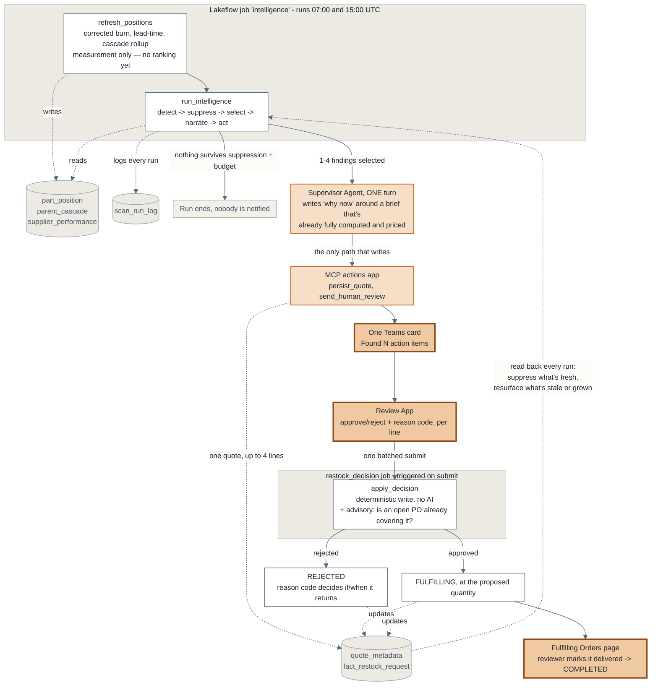

# Inventory Intelligence System

A plain walk-through of the pipeline: how every part in every warehouse gets checked twice a day —
and why only a handful of problems ever reach a person, in a single notification.

**In one sentence:** the system looks at everything, prices every problem it finds in real rupees,
picks the highest-value example of each *kind* of problem under a hard budget (usually three or
four), explains each one in plain terms with the arithmetic already done, and asks one person to
approve or reject them from one message.

**Why a handful, and why diverse.** One real MRP system produced 8,366 action messages in a week —
emitting everything true is the incumbent problem with better prose, not a fix for it. But scarcity
alone isn't enough either: ranked purely by rupee value, a run's top five are routinely four
transfers and one dead-capital item, because exposure varies by orders of magnitude between kinds
of problem. So the budget is spent round-robin across problem *types* (at most two of any one
kind), not as a global top-N — which is what actually determines what a reviewer sees. Measured
directly: ranking by "money after the cost of fixing it" instead of raw money reorders the middle of
the list a lot, but leaves the top few identical either way. The diversity rule is the one thing
that changes the output; the ranking formula, at this budget, mostly doesn't.

---

## The steps

| # | Step | What happens | Runs by |
|---|------|--------------|---------|
| 1 | **Measure, corrected** | Rebuilds three tables: real burn rate, real lead-time behaviour, real production cascades — for every part, warehouse and supplier | Automatic |
| 2 | **Find every problem** | Eight independent checks, each at the grain its problem actually lives at (a part, a supplier, a lane between two warehouses...) | Automatic |
| 3 | **Drop what's already being handled** | Anything with a live decision against it is removed — unless that decision has gone stale, in which case it comes back flagged | Automatic |
| 4 | **Pick the few that matter** | Merge duplicate views of the same problem, then take the top few under a budget, spread across problem types | Automatic |
| 5 | **Write it up and act** | One model turn: state why each pick needs a decision now, save the quote, send the notification | Automatic |
| 6 | **Send it to a person** | One Teams card, one review screen listing every picked item. Nothing is ordered yet | **Needs a person** |
| 7 | **Act only after approval** | Approved → placed and tracked immediately. Rejected → a reason code decides whether and when it can come back | Automatic |
| 8 | **Close the loop on delivery** | When the goods physically arrive, the reviewer marks the line delivered | **Needs a person** |

---

## The architecture



**Reading the colours:** white = a job task · light amber = the AI layer · darker amber = a person is
involved · grey cylinders = tables.

**Two rules the diagram encodes:**

1. **Detection is deterministic code, not the model.** Every figure a reviewer eventually reads —
   the exposure, the fix cost, the arithmetic trail — is computed by plain Python before the
   Supervisor ever sees it. There is no analysis step for it to get wrong, and nothing for it to
   look up.
2. **The MCP actions app is the only thing that writes.** Both of its tools are safe to call twice —
   the agent can retry without ever creating a duplicate quote or a duplicate Teams card.

**Why one model turn is enough now, when it used to take several.** Model Serving cuts off any
single request at roughly 290 seconds. The previous design ranked, then drilled into each picked
item with its own round of lookups, then wrote everything up — which didn't fit in one call and
timed out when tried. The redesign doesn't work around that limit, it removes the reason for it:
the detectors compute and price every finding *before* the brief is built, so there's nothing left
for a turn to go look up. What's left — writing one sentence per item and calling two tools — fits
comfortably in a single turn, however many findings are selected.

---

## Step 1 in detail — what "measure, corrected" actually means

`refresh_positions` rebuilds three tables from three years of transaction and delivery history.
Deliberately **measurement only** — no exposure, no ranking, no fix. Keeping judgement out of this
layer is what lets each problem-finder downstream work at its own natural grain instead of being
flattened onto one row, which is exactly the mistake the previous design made.

1. **`part_position`** — one row per part per warehouse. Real burn rate, not the flat number in the
   snapshot: intermittent parts (mostly zero-movement days) get a different treatment than steady
   ones, and a seasonal part's rate is corrected for the calendar rather than read off however busy
   it happens to be right now. Real lead time, not the contract: what the supplier actually
   delivers, and — just as important — how *consistent* they are about it, because a supplier who
   averages the contracted time but swings wildly around it is a different problem than a mean-only
   check can see at all.
2. **`parent_cascade`** — one row per (assembly, plant). Rolls the production plan **down** onto
   components rather than reading it bottom-up, so if three components each partly constrain one
   engine, that engine's value is counted once, not three times.
3. **`supplier_performance`** — one row per part per supplier, carrying the same lead-time reality
   plus observed reject rate and freight cost, so a sourcing decision can be judged on more than the
   quoted price.

### Example (illustrative, not real data)

| Part / Warehouse | On hand | Real burn/day | Real lead time | Cover left | Blocks a bigger build? |
|---|---|---|---|---|---|
| Bearing Assembly · Plant 3 | 40 | 6.5 | 12 ± 4 days | 6 days | **Yes — Motor Housing** |
| Control Relay · Plant 1 | 90 | 9.1 | 8 ± 1 day | 10 days | No, but 300 sit idle at Plant 2 |
| Hydraulic Seal · Plant 2 | 15 | 7.2 | 30 ± 11 days | 2 days | No — already approved 6 days ago |

Three different shapes of trouble, and none of them come from a plain "below safety stock" check:
a genuine near-term emergency, stock that's actually fine because a sister warehouse is sitting on
a pile of it, and a decision that's already been made but nothing has moved since.

---

## Step 2 in detail — eight kinds of problem, not two

The previous design could only ever produce two shapes of finding — a part below its safety stock,
or a part blocking an assembly — because both came out of one mutually-exclusive `CASE` expression
over a single row. Splitting detection into eight independent scanners, each running at the grain
its problem actually lives at, is the structural fix:

| Finding | Grain | What it catches |
|---|---|---|
| Stockout risk | part × warehouse | Will genuinely run out before a reorder can land — tested against *time*, not a static threshold |
| Cascade block | assembly × plant | A healthy-looking component that still stalls a critical build, naming every part that has to move together |
| Redeployment | part, across the network | Stock that's worth more somewhere else than where it's sitting. Structurally invisible to the old design; the strongest single opportunity in the evidence base |
| Dead capital | part × warehouse | Stock that will never be consumed — the mirror image of a shortage, and nobody else surfaces it |
| Lead-time signal | supplier | A supplier drifting late, or just unpredictable — reported once per supplier, not once per part they touch |
| Demand shift | part × warehouse | The real burn rate has moved and the safety stock hasn't caught up |
| Supplier economics | supplier × part | The cheapest quote isn't the cheapest supplier once rejects and unpredictability are priced in |
| MOQ uneconomic | part × supplier | The supplier's minimum order forces an overbuy that costs more than the risk it removes — the fix here is renegotiating the pack size, not placing the order |

Two of these are collapsed before they ever compete for a budget slot: a cascade block always wins
over its own binding children's individual shortages (same problem, seen from two ends), and a
transfer and a purchase on the same part/warehouse are alternatives, not two separate problems — the
cheaper one is kept, and the other is recorded as the option that was considered and set aside.

---

## Steps 3 and 4 in detail — dropping what's handled, picking what matters

**Suppression** removes a finding while a real decision against it is still live — in code, keyed on
whatever that finding is actually *about* (a supplier-level problem is suppressed by a decision
about that supplier, not by a decision about one of the dozen parts it touches). A decision only
suppresses while it's fresh: a pending approval re-surfaces after two days if nobody's acted, an
approved order re-surfaces if it's sat past its own lead time plus a grace period — because its
cost keeps accruing while it waits, and staying silently hidden is worse than showing up again
flagged as stalled.

A **rejection** is different, and it now carries a reason a reviewer actually picks from a list,
because "this isn't a real problem" and "I can't act on this right now" read almost identically as
free text but mean opposite things:

- *Can't act right now* — comes back on its own after two weeks. The constraint that blocked it
  (a budget freeze, someone on leave) usually lifts without anyone telling this system.
- *Not a real problem* / *the numbers looked wrong* — stays closed **until the stakes grow**: if the
  same problem is later worth 1.5× what it was when it was declined, that's a different question,
  not the same one asked again.

Every prior decision on a subject travels back into the write-up too, quoted in the reviewer's own
words — a rejection used to disappear silently and forever, which threw away the single most
informative thing in the system: a domain expert explaining, in their own language, why the machine
was wrong.

Only after suppression does the **budget** apply: a small fixed number of slots (four, by default),
filled round-robin across problem types rather than by a global top-N — see the note above on why
that, not the ranking formula, is what actually shapes what a reviewer sees.

---

## Step 5 in detail — keeping the numbers checkable

Every picked item is written up to a fixed template: the recommendation, the decision value, why
now (with a time-to-impact, not just a cost), what it costs **if approved and wrong**, the options
considered with the chosen one marked, and the evidence behind it. But unlike the previous design,
**almost none of that is written by the model** — it's computed in Python and handed over pre-built.
The model fills in exactly one sentence per item (why this needs a decision *now*) and reproduces
the rest verbatim.

That split exists because every documented failure here was the same shape: the model reaching for
a plausible-looking number that happened to be lying around, and presenting it as real. Each one was
already forbidden in writing at the time it happened — what actually stopped it was removing the
slot the wrong number could go into, not a better instruction:

- The cost of acting is pre-formatted **left to right as arithmetic, with the total last** —
  `200 x Rs 3,200 = Rs 6,40,000 plus Rs 4,160 holding = Rs 6,44,160`. A template with a headline
  slot to fill in *before* the arithmetic is what let the model fill it with an internal ranking
  score instead of a real price, once 5.6× off.
- **A transfer quotes no rupee cost at all** — moving stock the company already owns spends nothing.
  Told to state "the real cost, not zero," the model once back-solved a freight rate that exists
  nowhere in the data. The line instead states the actual downside in words: the donor warehouse is
  left with only so many days of its own cover, for nothing.
- **Evidence lines are verbatim field dumps**, not summaries — a summary has room to invent; a dump
  does not.
- **The model never chooses the order quantity.** It comes from a feasibility calculation, so a
  supplier's minimum-order constraint shows up in the report instead of quietly disappearing because
  a bigger requested number happened to clear it.

Once the write-up is done, the same turn calls the two write tools — `persist_quote`, then
`send_human_review` — using arguments that are also pre-resolved to real part and warehouse ids, not
typed out by the model. One live run once produced a full, polished report and **zero** saved lines,
because the model reached for a part's name instead of its id.

---

## Steps 6, 7 and 8 in detail — the human path

A reviewer decides **per part-line**, but stages every decision and submits them **once**. That
submit does not write — it validates, then triggers a job. (The Databricks Apps proxy caps a request
at 120 seconds, which is tighter than this needs to worry about now, but the job path stays for that
reason.)

The job then writes every decision deterministically, with no model involved. **Approving a line
moves it straight to `FULFILLING`** at the proposed quantity — there's no separate machine step
waiting in between any more. The one thing a machine step used to genuinely catch — a purchase
approved days after it was raised, when an open order already covers it — is now a plain database
check inside the same job: an advisory note on the screen, not a block, because the reviewer has
just said to go ahead.

The line's life, end to end:

```
PENDING_APPROVAL ─┬─> REJECTED    (reason code decides if/when it comes back — see Step 3/4)
                  └─> FULFILLING ──> COMPLETED   (reviewer confirms delivery)
```

Marking a delivery received is the one write the app does directly, with no job and no model in the
path — there's no judgement in "the truck arrived," so routing it through a job would buy nothing but
latency.

---

## Why a person still clicks approve

This isn't a safety net for model mistakes — it's accountability. Someone specific owns each restock
decision, and every action underneath is safe to repeat, so nothing gets ordered twice even if a step
retries itself.

---

## The quiet runs count too

Every run writes a row to `scan_run_log`, including the ones where nothing cleared the bar. Without
it, "nothing needed attention today" and "the job silently broke" look identical from outside — and
the anti-alert-fatigue claim this product rests on has no evidence behind it. With it, that claim is
a number: quiet on however many of the last N runs.

---

## Known open items

State these rather than waiting to be asked — all are recorded in the code or in
[docs/redesign_tracker.md](redesign_tracker.md):

- **The consequence figure for a part with no production plan behind it is still the weakest number
  in the system** — a criticality-weighted multiple of unserved demand, clearly labelled as an
  estimate rather than a measurement, but an estimate all the same.
- **Two problem types can structurally never win a budget slot at the current size** —
  `MOQ_UNECONOMIC` and, on this dataset, `STOCKOUT_RISK` — because their best examples are worth far
  less than the smallest transfer or dead-capital finding on the board. Whether that's a real
  priority or an artifact of a small budget is unresolved.
- **The ranking compares a recurring cost (dead capital's annual carrying cost) against one-time
  exposures on the same axis.** That mismatch is now named on screen rather than hidden, but it
  isn't fixed — it's how a large holding cost has outranked a smaller one-off production block on at
  least one real run.
- **No production catalog cutover has happened.** This pipeline runs against a replica catalog kept
  alongside Data Engineering's real one so it could be built and measured without touching
  production data; switching it over is a separate, real decision still to be made.
