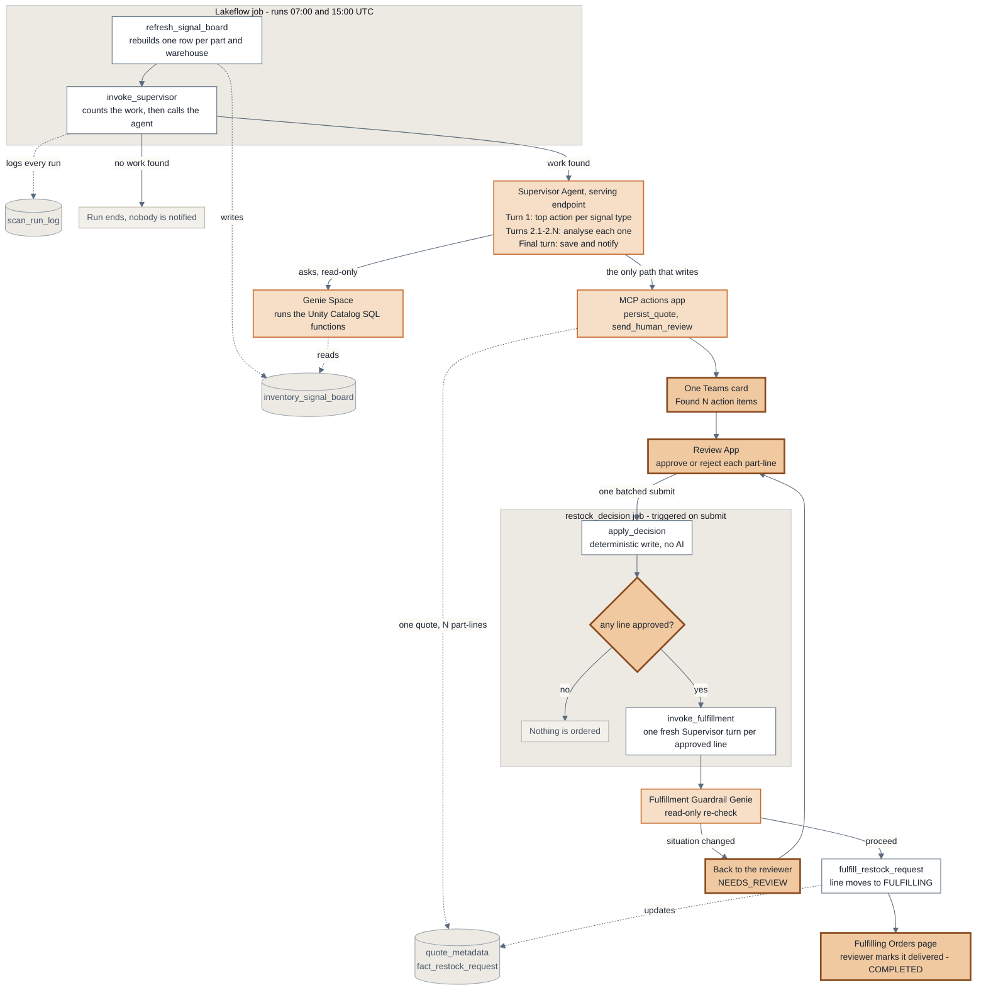

# Inventory Intelligence System

A plain walk-through of the Phase 1 pipeline: how every part in every warehouse gets checked
twice a day — and why only a handful of them reach a person, in a single notification.

**In one sentence:** the system doesn't send a person forty low-stock alerts a day — it looks at
everything, works out which problems actually cost money if ignored, picks the most
decision-worthy example of *each kind* of problem (usually one to three), explains them in plain
terms, and asks one person to approve or reject them from one message.

**Why a handful and not one, and not forty.** An earlier revision of this pipeline surfaced only
the single highest-value action per run. That reliably showed the loudest number and nothing else —
so the transfer-opportunity layer, the assembly-risk layer and the stalled-order layer could each
go weeks without ever appearing in front of a person, even while working correctly. The run now
surfaces the top-ranked action for **each distinct signal type currently live** (`STOCK_THRESHOLD`,
`BOM_CASCADE_RISK`, `STALLED_COMMITMENT` — typically 1–3 on a given day), bundled into **one quote
and one Teams card**. That is still the "hard output budget, ranked by money" that
`docs/market_evidence_phase1.md` §3 argues for — a bounded, ≤3–4-line, single-notification quote,
not a flood.

---

## The seven steps

| # | Step | What happens | Runs by |
|---|------|--------------|---------|
| 1 | **Check every part, everywhere** | Rebuilds one big table with the full picture for every part in every warehouse | Automatic |
| 2 | **Rank problems by money** | Scores every issue by what changes if someone acts; skips what's already handled; takes the top one of each kind | Automatic |
| 3 | **Dig into each picked issue** | For those parts only: can we transfer stock, is there a better supplier, does it block a build | Automatic |
| 4 | **Write it up in plain terms** | What to do, why, the cost of being wrong either way, what else was considered | Automatic |
| 5 | **Send it to a person** | One card in Teams and one review screen listing every picked item. Nothing is ordered yet | **Needs a person** |
| 6 | **Act only after approval** | Approved → re-checked against today's stock, then placed and tracked. Rejected → nothing happens | Automatic |
| 7 | **Close the loop on delivery** | When the goods physically arrive, the reviewer marks the line delivered | **Needs a person** |

---

## The architecture



**Reading the colours:** white = a job task · light amber = the AI layer · darker amber = a person is
involved · grey cylinders = tables.

**Two rules the diagram encodes:**

1. **Genie only reads.** All analysis goes through the Genie space, which can run the SQL functions
   but cannot write anything.
2. **The MCP actions app is the only thing that writes.** Every one of its tools is safe to call
   twice — the agent can retry without ever creating a duplicate order.

**Why the agent is called several times instead of once.** Model Serving cuts off any single
request at roughly 290 seconds. Ranking, plus a drill-down for each picked item, plus writing them
all up, does not fit in one call — it was tried, and it timed out. So each round-trip does one
small piece and resets the clock: one turn to rank, one turn per picked item, one turn to save and
notify. A day with more live signal types costs more wall-clock, never more risk of timing out.

---

## Step 1 in detail — what the signal board actually is

`refresh_signal_board` isn't a filter for "low stock". It rebuilds one big table, **one row per
part per warehouse**, covering the full working set — enough context to judge whether something is
a *real* problem worth someone's time.

**How it actually does that:** rather than asking "is this one part okay?" hundreds of thousands of
times, it computes every signal for every part/warehouse **in one query**, using joins and window
functions instead of a check-per-row. That's the only way this scales — a smart calculation that
re-scans the underlying data one row at a time falls over long before a real factory's part count.
So each run:

1. Takes the latest stock snapshot for every part in every warehouse (the raw data is a daily
   snapshot, so it picks the most recent day for each one).
2. Computes all seven signals below as columns, for the whole set at once — stock position, burn
   rate, supplier reliability, transfer options, assembly risk, and open-request state.
3. Replaces the table wholesale (`CREATE OR REPLACE`) — a full clean rebuild every run, not a
   patch on top of the last one.
4. Prints how many rows it wrote, and stops there.

That last point is deliberate: it does **not** also check how many of those rows are worth acting
on, even though that would be a handy thing to report. The function that ranks rows by urgency is
defined *after* this table exists (Spark checks a function's SQL against real tables when it's
created), so on a brand-new workspace, asking this step to also rank would deadlock the deploy —
the rebuild would fail calling a function that doesn't exist yet, so the fix for that would never
get the chance to deploy either. The urgency count happens one step later instead, inside
`invoke_supervisor`, once that ranking function is guaranteed to be there.

Each row carries:

- **Stock position** — on hand, safety level, maximum level, stock value
- **How fast it's going** — daily burn rate adjusted for seasonality, and days of cover left
- **Supplier reality** — contracted lead time vs. the delay actually observed, plus an on-time /
  quality reliability score
- **Can we borrow instead of buy** — the best warehouse holding spare stock, and whether that
  warehouse still covers itself after the transfer
- **Does it block something bigger** — the critical assembly this part would stall, and the value
  at risk
- **Is it already being handled** — any open request, and how long it's been sitting

### Example (illustrative, not real data)

| Part / Warehouse | Stock now | Days left | Borrow from elsewhere? | Blocks a bigger build? | Already handled? |
|---|---|---|---|---|---|
| Bearing Assembly · Plant 3 | 40 vs. 150 needed | 6 | No spare anywhere | **Yes — Motor Housing** | No |
| Control Relay · Plant 1 | 90 vs. 120 needed | 9 | Yes — Plant 2 has 300 | No | No |
| Hydraulic Seal · Plant 2 | 15 vs. 100 needed | 2 | No | No | **Approved 6 days ago, not delivered** |

Three different shapes of "low stock": a genuine emergency, a false alarm with a cheap fix, and an
order that's already approved but stuck — which gets flagged again rather than sitting silently
overdue.

---

## Step 2 in detail — how it picks what's most urgent

Every issue on the board gets one number: the money it's worth acting on.

```
  If we do nothing - production risk this week      Rs 38,000
  Cost to fix it now (rush shipping)               - Rs  1,200
  ------------------------------------------------------------
  Net value of acting today                          Rs 36,800
```

Ranking is by that net number, not by raw exposure — so a smaller problem a cheap transfer solves
can correctly outrank a bigger one nothing can fix. That is the intended behaviour, not an error
to correct for.

Two rules keep the list honest:

- An issue with an open order already in flight is **suppressed** — no duplicate quote.
- Unless that order has sat too long, in which case it comes back as a **stalled commitment**
  rather than staying silently hidden while the exposure keeps accruing.

Both live inside the ranking SQL as a `WHERE` clause, not in the agent's instructions. Anything
that has to hold *every* time belongs in deterministic code: a model that remembers to filter 97%
of the time re-raises a rejected item roughly monthly.

### The three kinds of problem, and why one of each

`rank_priority_actions` returns the global top N by decision value. `rank_priority_actions_diverse`
reuses that exact ranking and suppression, but returns the top row **per signal type** — which is
what a run actually calls, so each intelligence layer gets represented rather than being crowded
out by whichever number happens to be loudest today.

| Signal type | What it means | Why it needs its own slot |
|---|---|---|
| `STOCK_THRESHOLD` | On hand has fallen below safety stock | The obvious case — but on its own it's just a reorder alert |
| `BOM_CASCADE_RISK` | A part that looks healthy on its own would stall a critical assembly | Invisible to any single-part threshold check; usually the biggest rupee number |
| `STALLED_COMMITMENT` | Something was already approved, and nothing has arrived since | Nobody is alerted about a decision that was made — this is the layer that catches the gap |

The number of items in a run is therefore bounded by how many signal types are live, not by how
many parts are low — today at most three.

---

## Steps 3 and 4 in detail — keeping the numbers checkable

Every picked item is written up to a fixed contract: the recommendation, the decision value, why
now (with a time-to-impact, not just a cost), what it costs **if approved and wrong**, what is lost
**if rejected and right**, the options considered with the chosen one marked, and the evidence
behind it.

The governing rule is that **every figure a reviewer reads must be one they can check against
something**. Getting there took several live corrections, and each fix is structural rather than a
reminder in the prompt:

- The cost of acting is written **left to right as arithmetic, with the total last** —
  `200 x Rs 3,200 = Rs 6,40,000 plus Rs 4,160 holding = Rs 6,44,160`. Given a headline slot to
  fill in before the arithmetic, the model twice filled it with the ranking's internal cost
  estimate instead of a real price, once 5.6x off. Removing the slot fixed what prose could not.
- **A transfer quotes no rupee cost at all** — moving stock the company already owns spends
  nothing. Asked for "the real cost, not zero", the model back-solved a freight rate that exists
  nowhere in the data. The line now states the actual downside in words: the donor warehouse is
  left with only so many units of its own cover, for nothing.
- **Evidence lines are verbatim field dumps**, not summaries — a dump has no editorial latitude.
  Twice, a summarised line invented a holding cost against a real zero.
- **The model does not choose the order quantity.** The quantity comes from the feasibility
  function, so the supplier's minimum-order constraint appears in the report instead of being
  silently dissolved by asking for a bigger number.

The general failure mode worth remembering: ask for a figure where none exists and you get one
manufactured rather than refused. Where a number genuinely doesn't exist, the contract asks for
words.

---

## Steps 5, 6 and 7 in detail — the human path

A reviewer decides **per part-line**, but stages every decision and submits them **once**. That
submit does not write — it validates, then triggers a job. (The Databricks Apps proxy caps a
request at 120 seconds, and a cold agent round-trip has been measured at ~110s. Too close.)

The job then writes every decision deterministically, with no AI involved. Only if at least one
line was approved does it open one more agent turn per approved line, which asks a second,
read-only Genie space for a single verdict: does this still make sense against *today's* stock?

That guardrail exists for the case where a request sat waiting long enough that reality moved on —
stock replenished another way, a newer purchase order already covering it, demand collapsed. If it
says no, the line goes **back to the reviewer** as `NEEDS_REVIEW` rather than being executed
blindly, and they can retry or cancel it.

The line's life, end to end:

```
PENDING_APPROVAL ─┬─> REJECTED     (suppressed permanently - a closed decision)
                  └─> APPROVED ─┬─> FULFILLING ──> COMPLETED   (reviewer confirms delivery)
                                └─> NEEDS_REVIEW  (guardrail: reality changed, back to a human)
```

Marking a delivery received is the one write the app does directly, with no job and no AI in the
path — there is no judgment in "the truck arrived", so routing it through a job would buy nothing
but latency.

---

## Why a person still clicks approve

This isn't a safety net for model mistakes — it's accountability. Someone specific owns each
restock decision, and every action underneath is safe to repeat, so nothing gets ordered twice even
if the agent retries itself.

---

## The quiet runs count too

Every run writes a row to `scan_run_log`, including the ones where nothing cleared the bar. Without
it, "nothing needed attention today" and "the job silently broke" look identical from outside — and
the anti-alert-fatigue claim this product rests on has no evidence behind it. With it, that claim is
a number: quiet on 8 of 14 runs this week.

---

## Known open items

State these rather than waiting to be asked — all three are flagged in the code itself:

- The cost weights inside the decision-value calculation are provisional, not yet validated against
  real outcomes.
- `value_at_risk` uses "maximum stock level minus on hand" as a stand-in for the parent assembly's
  build target, because there is no production-plan or forecast table to read.
- Whether decision-value ranking actually reorders anything versus plain exposure ranking on real
  data is still unvalidated end to end.
