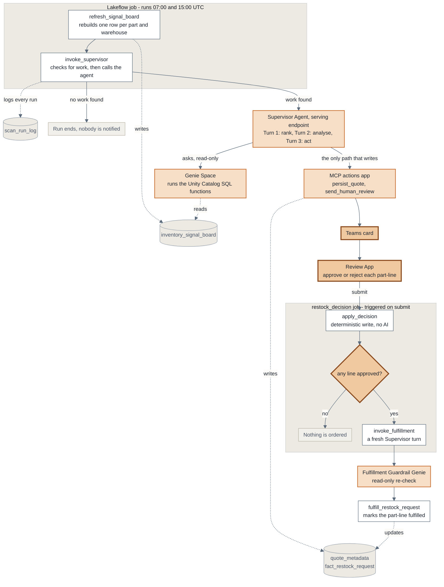

# Inventory Intelligence System

A plain walk-through of the Phase 1 pipeline: how a warehouse full of inventory numbers
turns into one clear recommendation a person can approve, twice a day, with no manual digging.

**In one sentence:** the system doesn't send a person forty low-stock alerts a day — it looks at
everything, works out which single problem costs the most money if ignored, explains it in plain
terms, and asks one person to approve or reject just that one thing.

---

## The six steps

| # | Step | What happens | Runs by |
|---|------|--------------|---------|
| 1 | **Check every part, everywhere** | Rebuilds one big table with the full picture for every part in every warehouse | Automatic |
| 2 | **Rank problems by money** | Works out which single issue costs the most if nobody acts; skips what's already handled | Automatic |
| 3 | **Dig into the top issue** | For that one part only: can we transfer stock, is there a better supplier, does it block a build | Automatic |
| 4 | **Write it up in plain terms** | What to do, why, the cost of being wrong either way, what else was considered | Automatic |
| 5 | **Send it to a person** | A card in Teams and a review screen. Nothing is ordered yet | **Needs a person** |
| 6 | **Act only after approval** | Approved → order or transfer placed and tracked. Rejected → nothing happens | Automatic |

---

## The architecture



**Reading the colours:** white = a job task · light amber = the AI layer · darker amber = a person is
involved · grey cylinders = tables.

**Two rules the diagram encodes:**

1. **Genie only reads.** All analysis goes through the Genie space, which can run the SQL functions
   but cannot write anything.
2. **The MCP actions app is the only thing that writes.** Every one of its tools is safe to call
   twice — the agent can retry without ever creating a duplicate order.

---

## Step 1 in detail — what the signal board actually is

`refresh_signal_board` isn't a filter for "low stock". It rebuilds one big table, **one row per
part per warehouse**, covering the full working set — enough context to judge whether something is
a *real* problem worth someone's time.

**How it actually does that:** rather than asking "is this one part okay?" hundreds of thousands of
times, it computes every signal for every part/warehouse **in one query**, using joins and window
functions instead of a check-per-row. That's the only way this scales — a smart calculation that
re-scans the underlying data one row at a time falls over long before a real factory's part count.
So each run:

1. Takes the latest stock snapshot for every part in every warehouse (the raw data is a daily
   snapshot, so it picks the most recent day for each one).
2. Computes all seven signals below as columns, for the whole set at once — stock position, burn
   rate, supplier reliability, transfer options, assembly risk, and open-request state.
3. Replaces the table wholesale (`CREATE OR REPLACE`) — a full clean rebuild every run, not a
   patch on top of the last one.
4. Prints how many rows it wrote, and stops there.

That last point is deliberate: it does **not** also check how many of those rows are worth acting
on, even though that would be a handy thing to report. The function that ranks rows by urgency is
defined *after* this table exists (Spark checks a function's SQL against real tables when it's
created), so on a brand-new workspace, asking this step to also rank would deadlock the deploy —
the rebuild would fail calling a function that doesn't exist yet, so the fix for that would never
get the chance to deploy either. The urgency count happens one step later instead, inside
`invoke_supervisor`, once that ranking function is guaranteed to be there.

Each row carries:

- **Stock position** — on hand, safety level, maximum level, stock value
- **How fast it's going** — daily burn rate adjusted for seasonality, and days of cover left
- **Supplier reality** — contracted lead time vs. the delay actually observed, plus an on-time /
  quality reliability score
- **Can we borrow instead of buy** — the best warehouse holding spare stock, and whether that
  warehouse still covers itself after the transfer
- **Does it block something bigger** — the critical assembly this part would stall, and the value
  at risk
- **Is it already being handled** — any open request, and how long it's been sitting

### Example (illustrative, not real data)

| Part / Warehouse | Stock now | Days left | Borrow from elsewhere? | Blocks a bigger build? | Already handled? |
|---|---|---|---|---|---|
| Bearing Assembly · Plant 3 | 40 vs. 150 needed | 6 | No spare anywhere | **Yes — Motor Housing** | No |
| Control Relay · Plant 1 | 90 vs. 120 needed | 9 | Yes — Plant 2 has 300 | No | No |
| Hydraulic Seal · Plant 2 | 15 vs. 100 needed | 2 | No | No | **Approved 6 days ago, not delivered** |

Three different shapes of "low stock": a genuine emergency, a false alarm with a cheap fix, and an
order that's already approved but stuck — which gets flagged again rather than sitting silently
overdue.

---

## Step 2 in detail — how it picks what's most urgent

Every issue on the board gets one number: the money it's worth acting on.

```
  If we do nothing - production risk this week      Rs 38,000
  Cost to fix it now (rush shipping)               - Rs  1,200
  ------------------------------------------------------------
  Net value of acting today                          Rs 36,800
```

The system picks whichever part has the biggest number — not whichever list is longest. If every
other issue is worth less once its own fix cost is subtracted, the Bearing Assembly goes first and
everything else waits for the next run.

Two rules keep the list honest:

- An issue with an open order already in flight is **suppressed** — no duplicate quote.
- Unless that order has sat too long, in which case it comes back as a **stalled commitment**
  rather than staying silently hidden while the exposure keeps accruing.

---

## Why a person still clicks approve

This isn't a safety net for model mistakes — it's accountability. Someone specific owns each
restock decision, and every action underneath is safe to repeat, so nothing gets ordered twice even
if the agent retries itself.

---

## Known open item

The cost weights inside the decision-value calculation are provisional — flagged in the code
itself, not yet validated against real outcomes.
